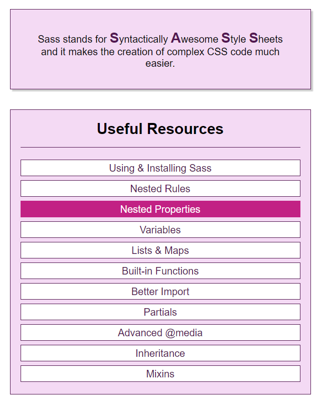

## SASS Practice

This project is a practice of SASS syntax and features for learning purposes.

### Topics covered:

- _Installing SASS_
- _Nested rules_
- _Nested properties_
- _Variables_
- _Lists and maps_
- _Built-in functions_
- _Better import_
- _Partials_
- _Advanced @media_
- _Inheritance_
- _Mixins_

### Usage

To play around with the code, the following command must be run:

`sass --watch main.scss main.css`

This will transpile the SASS code into ordinary CSS, which can be understood by the browser.

### Screenshot:

This practice is an exercise from the course _CSS - The Complete Guide 2020 (incl. Flexbox, Grid & Sass)_, produced by Academind.
